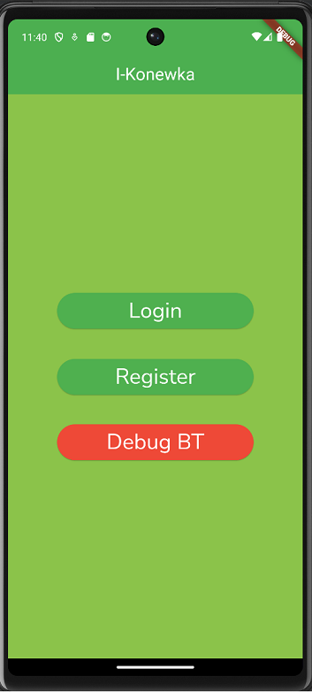
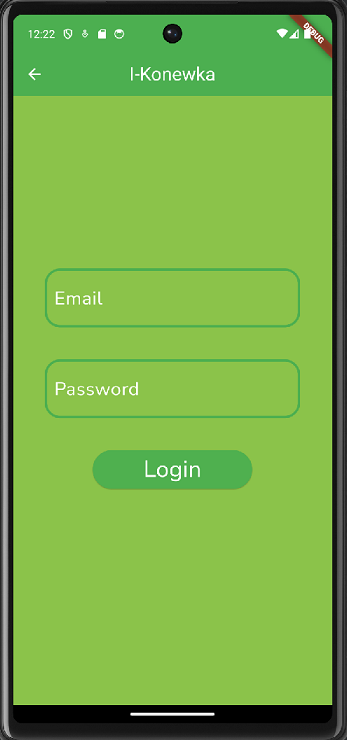
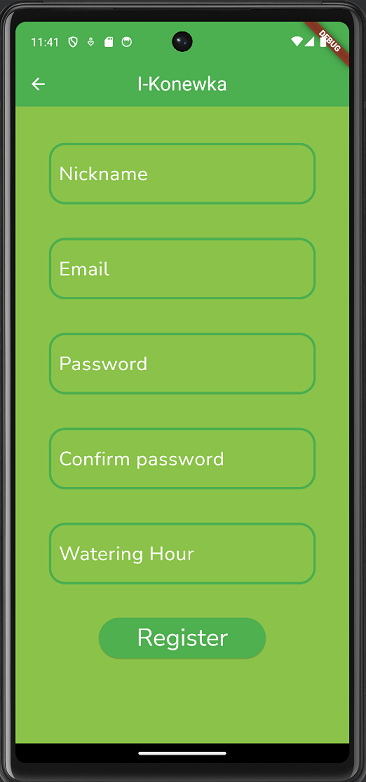
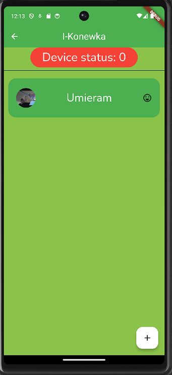

# i-konewka


Innowacyjna konewka do nawadniania roślin, wyposażona w rozpoznawanie gatunku kwiatów poprzez kamerę, to nasz projekt. Dzięki zaawansowanej technologii IoT i rozpoznawania wizyjnego, ma on za zadanie zrewolucjonizować pielęgnację roślin, poprawiając ich zdrowie i wzrost w każdym gospodarstwie domowym. Zaoszczędź czas i stwórz optymalne warunki dla roślin, niezależnie od poziomu doświadczenia – dla ogrodników profesjonalistów i początkujących miłośników zieleni. Podstawowe funkcje obejmują: planowanie podlewania, rozpoznawanie gatunku kwiatów oraz dedykowaną aplikację mobilną.

Cały system składa się z aplikacji mobilnej, którą użytkownik instaluje na swoim smartfonie, urządzenia IoT zawierającego mikroprocesor oraz pompy umożliwiającej podawanie wody roślinom.

<div style="page-break-after: always;"></div>

## Dokumentacja

### Schemat projektu

Projekt składa się z pięciu głównych części zaprezentowanych na rysunku poniżej. Każdą z nich opisano w tym dokumencie. Dodano też sposób komunikacji między konkretnymi modułami.


### Aplikacja mobilna

Aplikacja Flutter zaprojektowana w celu wsparcia urządzenia do podlewania poprzez dodanie kontroli i logiki. Użytkownik może utworzyć konto, w którym może przechowywać informacje o swoich roślinach, z różnymi atrybutami. Kamera zainstalowana w smartfonie może być używana do identyfikacji kwiatów użytkownika. Dzięki silnikowi identyfikacji roślin i oceny zdrowia dostarczanemu przez API PlantId.

### API i-konewka

Część "backend" projektu i-konewka została wykonana z użyciem frameworka [Flask](https://flask.palletsprojects.com/). Został on wybrany ze względu na niewielki narzut oraz prostotę, która została postawiona postawiona ponad skomplikowanie innych rozwiązań wykorzystywanych w tej dziedzinie. Łatwa do użycia składnia Flaska pozoliła nam w stosunkowo krótkim czasie wytworzyć w pełni fnkcjonalną oraz poprawną w kontekście rozwoju aplikację. Wszystkie założone w projekcie funkcjonalności zostały zaimplementowane.

<div style="page-break-after: always;"></div>

Lista endpoit'ów:

* ``/auth/register`` - rejestracja użytkowmika
* ``/auth/login`` - logowanie użytkownika
* ``/api/user_information`` - pobranie informacji o użytkowniku
* ``/api/add_flower`` - dodanie kwiatka do bazy danych
* ``/api/add_flower_photo`` - dodanie zdjęcia kwiatka
* ``/api/user_flowers`` -  pobranie informacji o kwiatach uzytkownika
* ``/api/flower_details`` - pobranie wszystkich informacji o kwiatku
* ``/api/add_watering`` - dodanie podlewania do bazy danych
* ``/api/get_last_waterings`` - pobranie ostatnich podlewań
* ``/api/delete_flower`` - usunięcie kwiatka z bazy danych
* ``/api/update_flower`` - zmiana informacji o kwiatku

### Uwierzytelnianie

Odpowiedzialne za uwierzytelnianie użytkownika endpointy `/auth/register` oraz `/auth/login` odpowiednio dodają oraz wyszukują użytkownika o podanych parametrach w celu umożliwienia mu korzystania z funkcjonalności aplikacji.

Po przesłaniu przez formularz logowania informacji, które znajdują dopasowanie w bazie danych, odsyłany jest token (JWT), który aplikacja mobilna zachowuje w celu dalszego korzystania z endpointów.

### Obsługa roślin

W zbiorze endpointów części backend zdefiniowano zakres tych odpowiedzialnych za operacje na roślinach użytkownika. Każda z nich zapewnia unikalną funkcjonalność, co daje przejżysty i łatwy w utrzymaniu kod.

Wszystkie niżej opisane pocedury wymagają zalogowanego użytkownika, który jest rozróżniany za pośrednictwem przesyłanego w nagłówku zapytania tokenu.

#### Wyświetlanie

W celach prezentacji danych w aplikacji zostały przygotowane endpointy `/api/user_information`, `/api/user_flowers`, `/api/flower_details` oraz `/api/get_last_waterings`. Zwracają one podstawowe informacje o użytkowniku, zapisanych przez niego roślinach, o ilości tych roślin, ich parametrach oraz wykonanych podlewaniach dowolnego z posiadanych kwiatów.

#### Dodawanie

Endpointy `/api/add_flower` oraz `/api/add_flower_photo`. Ich zadaniem jest zapewnienie możliwości dodawania roślin do bazy danych. W czasie pierwszego dodania rośliny następuje jej identyfikacja za pomocą usługi PlantId co zostało szerzej opisane w rozdziale [API PlantId](#api-plantid). Kolejno ustalane są szczegóły planu podlewania z wykorzystaniem ChatGPT (rozdział [API openAI](#api-openai)).

Po dodaniu kolejnego zdjęcia do już istniejącego kwiatka następuje jedynie identyfikacja jego zdrowia, którego nowa wartość wpisywana jest do bazy danych.

<div style="page-break-after: always;"></div>

#### Podlewanie

Każdorazowe podlanie kwiatka musi być poprzedzone odnotowaniem tego w bazie danych poprzez wykonanie zapytania na endpoint `/api/add_flower_photo`. Rejestrowane są: identyfikator rośliny, moment podlania oraz ilość dozowanej wody.

#### Modyfikacja

Prezentowane rozwiązanie umożliwia, za pośrednictwem endpointu `/api/update_flower`, bardziej zaawansowanemu użytkownikowi modyfikację automatycznie proponowanych parametrów. Możliwa jest zmiana nazwy, harmonogramu podlewania czy ilości podawanej wody.

#### Usuwanie

Przygotowany endpoint `/api/delete_flower` pozwala na usunięcie niechcianej rośliny z bazy danych aplikacji. Usunięcie powoduje aktualizację pozostałych tabel w bazie danych, aby jej spójność nie została utracona (rozdział [Baza danych](#baza-danych)).

### API PlantId

Plant.id to zaawansowane narzędzie identyfikacji roślin, oferujące precyzyjne rozpoznawanie ponad 33 000 taksonów, obejmując rośliny doniczkowe, ogrodowe, drzewa, chwasty, grzyby i porosty z całego świata. Baza danych zawiera bogate informacje, obejmujące nazwę zwyczajową, krótki opis, klasyfikację oraz naukową (łacińską) nazwę dla każdej zidentyfikowanej rośliny.

Dodatkowo, Plant.id oferuje funkcję Oceny Zdrowia, która umożliwia użytkownikom rozpoznanie potencjalnych chorób roślin. Model wykrywa aż 90 różnych schorzeń, obejmujących szkodniki, choroby grzybowe i problemy związane z nadmiernym podlewaniem. Po zidentyfikowaniu rośliny, wystarczy kliknąć na ikonę choroby, aby uzyskać informacje na temat jej stanu zdrowia.

Potęga w dziedzinie uczenia maszynowego opiera się na najnowocześniejszych metodach, w tym niestandardowych głębokich sieciach neuronowych konwolucyjnych. Dzięki temu osiągamy doskonałe wyniki, szacując, że nazwę rośliny uda się poprawnie ustalić w 90% przypadków.

### API openAI

OpenAI API to interfejs programistyczny (API) udostępniany przez firmę OpenAI, umożliwiający deweloperom integrację zaawansowanych modeli językowych w swoich aplikacjach i usługach. Kluczowym elementem API jest użycie modelu GPT (Generative Pre-trained Transformer) do generowania tekstów na podstawie dostarczonych wejść.

W projekcie zostało wykorzystane do dopasowania ilości potrzebnej do podlania kwiatka oraz liczbie dni podlewań w tygodniu. Informacje ustalono na podstawie gatunku kwiatka.

Kod z implementacją znajduje się w pliku [chatgpt.py](./backend/src/chatgpt.py)

<div style="page-break-after: always;"></div>

### Baza danych


W bazie danych znajduje się kilka kluczowych tabel. Pierwsza z nich to **USERS**, która przechowuje informacje o użytkownikach. Każdy użytkownik ma unikalny identyfikator (uid), nick, liczbę posiadanych kwiatów (nof_flowers), adres email, hasło, godzinę podlewania (watering_hour), oraz datę rozpoczęcia korzystania z systemu (start).

Drugą istotną tabelą jest **FLOWER_TYPES**, która definiuje różne typy kwiatów. Każdy typ ma swój unikalny identyfikator (ftid), nazwę, dodatkowe notatki (note), liczbę dni między podlewaniem (nof_watering_days), oraz ilość mililitrów wody potrzebną do podlania (ml_per_watering).

Kolejna tabela, **FLOWERS**, zawiera informacje o konkretnych kwiatach. Każdy kwiat ma swój unikalny identyfikator (fid), przypisanego użytkownika (uid), typ kwiatu (ftid), nazwę, stan zdrowia (health), datę dodania do systemu (start), ilość mililitrów wody na podlewanie (ml_per_watering), oraz informacje o dniach tygodnia, w których należy podlewać (monday, tuesday, ..., sunday).

Historia podlewania kwiatów przechowywana jest w tabeli **HISTORY**. Każde podlewanie ma swój unikalny identyfikator (hid), identyfikator kwiatu (fid), identyfikator użytkownika (uid), oraz datę i godzinę podlewania (watering).

Ostatnia tabela, **IMAGES**, zawiera informacje o obrazach przypisanych do konkretnych kwiatów. Każdy obraz ma swój unikalny identyfikator (iid), identyfikator kwiatu (fid), sam obraz w formie długiego tekstu (image), oraz datę i godzinę dodania obrazu (image_timestamp).

Wszystkie te tabele są ze sobą powiązane za pomocą kluczy obcych (foreign keys), co umożliwia skonstruowanie spójnej bazy danych, gdzie informacje o użytkownikach, typach kwiatów, konkretnych kwiatach, historii podlewania i obrazach są ze sobą powiązane.

Plik ze wstępną konfiguracją bazy danych: [init_schema.sql](./database/init_schema.sql)

### Docker

Po wytworzeniu oprogramowania dla aplikacji i-konewka koniecznym stało się udostępnienie jej dla klientów indywidualnych, którzy, za pośrednictwem aplikacji mobilnej, będą korzystac z funkcjonalności dla nich przygotowanych.

Do tego celu wybrana została pratforma [Docker](https://www.docker.com/). W ramach konfiguracji serwera aplikacji *i-konewka* przygotowany został plik komend generujący obrazy przeznaczone do działania w środowisku produkcyjnym. Instancje części backendowej zostały uruchomione z wykorzystaniem frameworka [Gunicorn](https://gunicorn.org/), oferującego w pełni funkcjonalny serwer produkcyjny; dopasowany pod wzdlęgami zarówno wydajności, jak i bezpieczeństwa, do potrzeb wprowadzanej na rynek aplikacji.

W podobny sposób przygotowano kontener obsługujący serwer bazodanowy, w oparciu o plik konfiguracyjny opisany w rozdziale [Baza Danych](#baza-danych). Z uwagi na skomplikowanie, wydajność, jak i bezpieczeństwo danych, zdecydowano się na utworzenie osobnej instancji bazy danych w środowisku *Docker.*

Na potrzeby komunikacji sieciowej *baza danych - backend*, z wykorzystaniem platformy *Docker,* została utworzona wirtualna sieć *ikonewa_network*. W tej sieci uruchomione zostały: kontener *backend*, kontener *mysql*.

W celu ekspozycji aplikacji na ruch użytkowników udostępnione zostało dodane przekierowanie portów umożliwiające połączenie tunelu cloudflare oraz kontenera z portem 60001.

<div style="page-break-after: always;"></div>

### Kubernetes

Drugą możliwością uruchomienia aplikacji zostało wystawienie *deployment* za pośrednictwem [Kubernetes](https://kubernetes.io/). Do tego celu dopasowany został kod aplikacji: dane wrażliwe przeniesione zostały do elementu *secret* definiowanego poprzez plik `ikonewka_secrets.yaml`:

```
apiVersion: v1
kind: Secret
metadata:
    name: ikonewka-secret
type: Opaque
data:
    JWT_KEY: <key_in_base64>
    OPENAI_API_KEY: <key_in_base64>
    PLANTID_API_KEY: <key_in_base64>
    MYSQL_HOST: <host_in_base64>
    MYSQL_DATABASE: <database_in_base64>
    MYSQL_USER: <user_in_base64>
    MYSQL_PASSWORD: <password_in_base64>
```

Dodatkowo, zarówno dla części *backend* oraz *database* utworzono pliki .yaml definiujące potrzebne komponenty w *Kubernetes*.
Aby zrealizować wdrożenie wystarczy uruchomić w każdym z komponentów plik `Makefile` korzystając z polecenia `make prod`.

Po zbudowaniu, otagowaniu oraz wypchnięciu obrazu do repozytorium można uruchomić procesy w *Kubernetes*:

```
kubectl apply -f ikonewka_secrets.yaml
```

* backend

    ```
    kubectl apply -f ikonewka_backend_persistentvolume.yaml
    kubectl apply -f ikonewka_backend_persistentvolumeclaim.yaml
    kubectl apply -f ikonewka_backend_deployment.yaml
    ```

* database

    ```
    kubectl apply -f ikonewka_mysql_persistentvolume.yaml
    kubectl apply -f ikonewka_mysql_persistentvolumeclaim.yaml
    kubectl apply -f ikonewka_mysql_service.yaml
    kubectl apply -f ikonewka_mysql_deployment.yaml
    ```

<div style="page-break-after: always;"></div>

### Cloudflare

Część backend aplikacji *i-konewka* otrzymała osobisty identyfikator w sieci internet za pośrednictwem wykupionej do tego celu domeny [ikonewka.panyre.pl](ikonewka.panyre.pl). Na potrzeby udostępnienia pracującej w środowisku *Docker* aplikacji został utworzony tunel z wykorzystaniem usugi [cloudflared](https://developers.cloudflare.com/cloudflare-one/connections/connect-networks/downloads/), wykorzystujący technikę przekierowania portów TCP na usługę docelową pracującą na porcie 60001. Dzięki tunelowaniu ruchu https, możliwe stało się upublicznienie API aplikacji *i-konewka* w sieci Internet pod podanym wyżej adresem, z użyciem bezpiecznej dla użytkownika końcowego, w pełni szyfrowanej komunikacji TLS.

## Fizyczne urządzenie

Budowa urządzenia zoptymalizowana została w celu możliwości szybkiego i taniego wydruku w technologii druku 3D. Model został podzielony na kilka mniejszych elementów dla uniknięcia przymusu druku supportów(materiału wsparciowego). Montaż jest prosty do wykonania przy pomocy kleju cyjanoakrylowego(tzw. kropelka/superglue). Konewka składa się z dwóch głównych części, górnej i dolnej, przymocowanej do siebie magnesami neodymowymi w celu łatwego demontażu akumulatora.

Model drukuje się przez niecałe 4 godziny, natomiast koszt filamentu to około 5zł. Do tego kosztu dodać należy wartość 4 magnesów neodymowych tj. około 2zł.

### Lista potrzebnego sprzętu

Do wykonania wykorzystane zostały następujące elementy elektroniczne:

1) ESP32-DEV
2) Moduł przekaźnika sterowany sygnałem 5V
3) Przetwornica STEP-UP 12V
4) Przetwornica STEP-DOWN 5V
5) Pompa perystaltyczna 12V
6) Akumulator Li-Pol 2S1P 7.4V

### Arduino

Używamy płytki Arduino ESP32 oraz biblioteki BluetoothSerial do połączeń Bluetooth. Pompa jest podłączona do Arduino na pinie 2.

#### Połączenie Bluetooth

Każde polecenie zawiera **head** i **value**. Żadne z nich nie powinno przekraczać długości 100 znaków. Są one odbierane jako zwykły tekst i oddzielone spacją. Istnieją dwie komendy, które można wykonać:
* connect - nie ma wartości i zwraca tekst "ok". Służy do upewnienia się, że jesteś podłączony do dobrego urządzenia.
* water - zawiera wartość całkowitą jako liczbę mililitrów, które zostaną przepompowane. Nie zwraca żadnej wartości

#### Kod

Kod Arduino jest podzielony na trzy kluczowe segmenty:
* setup - część kodu, która działa raz, po uruchomieniu Arduino. W naszym kodzie definiujemy pin pompy jako wyjście cyfrowe i otwieramy szeregowy Bluetooth.
* loop - ta część kodu działa w pętli po konfiguracji. W każdej iteracji sprawdzamy dostępność szeregowego Bluetooth i odbieramy polecenia. Główną częścią kodu jest nawadnianie, wywoływane poleceniem "water". Jego parametrem jest liczba mililitrów, przeliczana na liczbę milisekund pracy pompy przez stałą PUMP_CAPACITY = 0,0015 [ml/msec]. Wykonywanie nawadniania nie jest blokowane. Oznacza to, że gdy nawadnianie jest włączone, Arduino nie czeka na zakończenie nawadniania i może wykonywać inne czynności. Mierzy czas w każdej iteracji i odejmuje go od całkowitego czasu, przez jaki pompa powinna być włączona. Gdy czas ten dojdzie do zera, nawadnianie zostanie zatrzymane.

#### Klasa Command

Ta klasa służy do interpretowania poleceń wejściowych. Posiada kilka publicznych metod:
* read - odczytuje dane z portu szeregowego i dzieli je na dwie tablice znaków: nagłówek i wartość (każda o maksymalnej długości 100 znaków).
* is - pobiera tablicę znaków jako dane wejściowe i sprawdza, czy nagłówek jest równy tablicy wejściowej
* isVal - pobiera tablicę znaków jako dane wejściowe i sprawdza, czy wartość jest równa tablicy wejściowej
* valToInt - próbuje przekonwertować wartość z tablicy znaków na liczbę całkowitą

<div style="page-break-after: always;"></div>

## Aplikacja

### Projekt aplikacji w Figmie

Pierwszym etapem dostarczania aplikacji było wykonanie wstępnego szkicu projektu. Zaprojektowaliśmy trzy ekrany - logowanie i rejestracja zostały pominięte:
* Ekran główny (*Home*), w którym znajdują się widgety z kwiatkami użytkownika
* Ekran dodawania kwiatka (*AddPlant*), umożliwiający dodanie rośliny
* Ekran edycji kwiatka (*EditPlant*), pozwalający na zmianę parametrów danej rośliny.

Choć finalna wersja aplikacji odbiega od szkicu, to zachowane zostały kluczowe elementy zamieszczone w prototypie:


### Obsługa kamery

Korzystano między innymi z pakiety *package:camera*, który służy do obsługi funkcji kamery.
Początkowo wykrywane są wszystkie kamery w urządzeniu (komputer, laptop, telefon, tablet), a następnie wybierana jest domyślna z nich. Jak obsłużenie działania kamery zostało już zainicjowane, wyświetlany jest podgląd kamery *CameraPreview*, w przeciwnym razie widoczny jest wskaźnik postępu *CircularProgressIndicator*.
Rozdzielczość wykonywania zdjęć jest ustalona na charakterystyczną dla uprzednio wybranej kamery, aby zdjęcia były wykonywane w odpowiedniej jakości np. *ResolutionPreset.high*.
Obraz z kamery jest jednocześnie wyświetlany na ekranie użytkownika, aby był on w stanie stwierdzić czy na nim widać cały interesujący nas obiekt.
Po wciśnięciu odpowiedniego przycisku znajdującego się na dole strony, wykonywane jest zdjęcie, które następnie jest zapisywane do pamięci podręcznej urządzenia.
Na samym końcu metoda dispose zamyka kontroler kamery, aby zwolnić zasoby podczas usuwania widoku.

<div style="page-break-after: always;"></div>

### Wysyłanie żądań/zapytań do API z poziomu darta

Korzystano między innymi z pakietu *package:http*.
Została zdefiniowana klasa ApiHelper, która zawiera metody do wykonywania żądań HTTP (GET, POST, PUT) wraz z możliwością autoryzacji. Klasa ta przyjmuje bazowy URL podczas inicjalizacji np. [Backend API](https://ikonewka.panyre.pl). Na podstawie podanego linku umożliwia się wysyłanie różnych rodzajów zapytań do tego URL wraz z odpowiednimi parametrami np. user i hasło czy dodatkowe informacje o obsługiwanych roślinach.
Po wykonaniu zdjęcia z pomocą pakietu *camera* jest ono przetwarzane i kodowane *Base64*. Po udanej takiej operacji jest ono przesyłane za pomocą metod HTTP do API narzędzia PlantId udostępnionego nam przez firmę kindwise.
Dodatkowo metody HTTP obsługują odpowiednio usuwanie, dodawanie czy edytowanie informacji o roślinach użytkownika w naszej aplikacji. Wszystkie metody (GET, POST, PUT) zwracają mapę zawierającą dane z odpowiedzi HTTP. W przypadku sukcesu (kod statusu 200), mapa zawiera otrzymane dane, a w przeciwnym razie rzucany jest wyjątek. Wynik każdego żądania jest przekazywany do prywatnej metody _*handleResponse*, która obsługuje odpowiedzi HTTP, parsuje dane JSON i dodatkowo jest w stanie odpowiedzieć na ewentualne błędy.

### Obsługa Bluetooth

Aplikacja korzysta z biblioteki do obsługi Bluetooth Classic do przesyłania danych po połączniu serialowym. W trakcie projektowania interfejsu Bluetooth zmieniała się koncepcja rozwiązania wraz z narzędziami. Użycie BT Classic wymusiło wykorzystanie niesprawdzonych i przestarzałych bibliotek Flutterowych. Wstępna wersja aplikacji wraz z interfejsem debugowym, pozwalającym m.in. wysłanie spreparowanych komend do Arduino przy testach end-to-end okazała się nie realizować postawionych zadań - tutaj jako powód wytypowano i potwierdzono przestarzałość biblioteki *flutter_bluetooth_classis*. Wiekowość Bluetooth Classic i niewiele dostępnych (raptem jedna) biblioteka do obsługi tego systemu wymusiło skorzystanie z nieprzetestowanej biblioteki *bluetooth_classic* w wersji 0.0.1 z raptem 7 like'ami. Okrojony format, brak obsługi błędów i dostępu do sterowania strumieniami do obsługi zdarzeń (zmiana statusu urządzenia, podsłuchiwanie danych otrzymanych na połączenie serialowe) poskutkowało równie okrojonym interfejsem BT.
Obie z podstron 'Debug BT' i 'Home' korzystają z własnych uchwytów do obsługi BT - wszelkie próby zaimplementowania Singletona się nie powiodły.

Wybrana biblioteka niespodziewanie zadziałała (została dostarczona w październiku 2023 i wykorzystywała wspierane API Androida, w przeciwieństwie do wcześniejszej biblioteki) - koniecznie jednak dodanie było zmiennej globalnej śledzącej, czy otwarty został listener na zmiany statusu BT - powtórne dodanie listenera skutkowało zatrzymaniem aplikacji:

* main.dart

```
bool IS_LISTENED_TO = false;
```

<div style="page-break-after: always;"></div>

* 'Home' / 'Debug BT'

```
if (!IS_LISTENED_TO) {
  BT_DEV.onDeviceStatusChanged().listen((event) {
    setState(() {
      _DEVICE_STATUS = event;
    });
  });
  IS_LISTENED_TO = true;
}
```

Dodatkowo na finalnym etapie testowania aplikacji na telefonie z Androidem 13 pojawił się problem z łącznościom BT. Okazało się, że w API 34 Androida konieczne jest przyznanie aplikacjo dostępu do funkcji skanowania otoczenia. Realizujemy to poniższym fragmentem kodu:

```
Future<void> initPermissionsApi34() async {
    Map<Permission, PermissionStatus> statuses = await [
      Permission.bluetoothScan,
      Permission.bluetoothAdvertise
    ].request();

    if (statuses[Permission.bluetoothScan] == PermissionStatus.granted &&
        statuses[Permission.bluetoothAdvertise] == PermissionStatus.granted) {
      setState(() {
        _bluetoothPermissions = true;
      });
    }
  }
```

Pierwsze próby połączeniu z Arduino realizowane jest po poprawnym zalogowaniu. Po przejściu do podstrony 'Home' w tle wywoływana jest asynchroniczna metoda *initConnection* łącząca aplikację z Arduino poprzez standaryzowanym serwis UUID dla połączeń serialowych: **00001101-0000-1000-8000-00805f9b34fb**. Metoda aktualizuje status połączenia, który wykorzystywany jest do obsługi ewentualnych błędów, czy prób podlania kwiatka bez uprzedniego sparowania urządzenia.

```
  Future<void> initConnection() async {
    await BT_DEV.connect(deviceAddress, defaultUuid).then((bool result) {
      setState(() {
        connectionUp = result;
      });
    });
  }
```

<div style="page-break-after: always;"></div>

W przypadku braku połączenia użytkownik promptowany jest o ponowienie próby połączenia z Arduino poprzez stosowny alert. Po kliknięciu w przycisk wywoływana jest medoda _*initConnectionProcess*, łącząca aplikację ze sprzętem.

```
Alert(
            type: AlertType.error,
            style: CustomAlertStyle.alertStyle,
            context: context,
            title: "Cannot water the plant",
            desc: "Please make sure the device is connected before watering.",
            buttons: [
              DialogButton(
                onPressed:
                    !_connectionInProgress ? _initConnectionProcess : null,
                color: Colors.red,
                child: const Text(
                  "OK, redo connection",
                  style: TextStyle(
                      fontWeight: FontWeight.bold,
                      color: Colors.white,
                      fontSize: 20),
                ),
              ),
            ],
          ).show();
...

Future<void> _initConnectionProcess() async {
    _connectionInProgress = true;
    await initConnection();
    if (!context.mounted) return;
    Navigator.pop(context);
    _connectionInProgress = false;
  }

```

Kod realizujący podlewanie kwiatków opatrzony jest dodatkowo o stosowne alerty, aktualizowane o wartość wyjątku, który może pojawić się podczas próby pisania do Arduino. Obsłużone są zarówno wyjątki dotyczące podlewania, kiedy sprzęt nie został sparowany, jak i wyjątki samego pisania do zdalnego urządzenia.

<div style="page-break-after: always;"></div>

```
Future<void> _sendWaterProcess() async {
    _waterInProgress = true;
    var popUp = CustomLoadingPopUp(context: context);
    popUp.show();
    var result = await sendWater("${widget.waterAmount}", BT_DEV);
    var errorPopUp;
    switch (result) {
      case 0:
        break;
      case 1:
        errorPopUp = CustomErrorPopUp(context: context, reason: 'connecting');
        break;
      case 2:
        errorPopUp = CustomErrorPopUp(context: context, reason: 'watering');
        break;
      default:
        break;
    }
    popUp.dismiss();

    if (!context.mounted) return;
    Navigator.pop(context);
    if (errorPopUp != null) {
      errorPopUp.show();
    }
    _waterInProgress = false;
  }
```
<div style="page-break-after: always;"></div>

### Szkielet aplikacji

Aplikacja składała się z następujących elementów:

* ekran startowy



<div style="page-break-after: always;"></div>

* ekran logowania



<div style="page-break-after: always;"></div>

* ekran rejestracji



<div style="page-break-after: always;"></div>

* ekran domowy



<div style="page-break-after: always;"></div>

* ekran dodający kwiatki


<div style="page-break-after: always;"></div>

* ekran edytujący kwiatki


<div style="page-break-after: always;"></div>

W aplikacji został obsłużony routing routing pomiędzy konkretnymi ekranami, komunikacja z backendem (opisana powyżej), komunikacja z bluetooth (opisana powyżej), obsługa kamery (opisana wyżej).

Widgety widoczne w aplikacji renderują się w zależności od zwracanych przez backend danych (poniżej przykład wyświetlania kwiatków użytkownika).

```
          SingleChildScrollView(
              child: FutureBuilder<List<Plant>?>(
                  future: plants,
                  builder: (context, snapshot) {
                    if (snapshot.hasData &&
                        snapshot.connectionState == ConnectionState.done) {
                      return ListView.separated(
                          shrinkWrap: true,
                          reverse: false,
                          itemBuilder: (context, index) => PlantContainer(
                                height: 100,
                                width: 100,
                                fontSize: 28,
                                name: snapshot.data?[index].name,
                                icon: Icons.sentiment_very_satisfied,
                                image: snapshot.data![index].getImageWidget(),
                                plantId: snapshot.data![index].fid,
                                waterAmount:
                                    snapshot.data![index].ml_per_watering,
                              ),
                          itemCount: snapshot.data!.length,
                          separatorBuilder: (BuildContext context, int index) =>
                              const SizedBox(height: 0));
                    } else {
                      return const Text('');
                    }
                  })),
```

<div style="page-break-after: always;"></div>

W aplikacji zostały także zaimplementowane cztery różne formularze:

* logowanie
* rejestracja
* dodawanie kwiatka
* edycja kwiatka

W celu ułatwienia i przyśpieszenia prac zostały także utworzone pomocnicze obiekty oraz klasy stali:

* AlertStyle - styl alertów
* Bar - Pasek na górze aplikacji
* CameraPage - Panel obsługujący kamerę i przechwytujący zdjęcie
* CustomButton - Przycisk o określonym stylu
* CustomLoadingPopUp - PopUp
* CustomTextFormField - Widget wykorzystywany w formularzach
* CustomToggleButton - Widget pokazujący dni tygodnia, w którym chcemy podlewać kwiatka
* PlantContainer - Wyświetla w Home kwiatka użytkownika
* PlantImage - wyświetla zdjęcie kwiatka w PlantContainer
* AppTheme - Definiuje style aplikacji, trzcionki, rozmiary, kolory

<div style="page-break-after: always;"></div>

## Rozeznanie rynku

Podczas prac nad aplikacją zdecydowaliśmy się przeprowadzić pełną analizę rynku, która pozwoliła nam scharakteryzować potencjalnych klientów (persony) aplikacji oraz opinie ekspertów od opieki nad roślinami.
Zaczynając od początku zostały stworzone trzy różne persony, które mają różne wymagania oraz oczekiwania względem aplikacji.


Podczas pracy nad aplikacją staraliśmy się odpowiadać na żądania oraz obawy potencjalnych użytkowników względem aplikacji, aby byli skorzy ją wykorzystać do codziennego użycia. To doskonale pokazuje, że nasz projekt jest zdecydowanie skierowany na użytkownika końcowegom co jest niezwykle istotne w tworzeniu aplikacji mobilnych, które mają być łatwe oraz przyjemne w obsłudze.

Poniżej przedstawiamy parę kluczowych wniosków, które zostały wyciągnięte po szczegółowej ankiecie przeprowadzonej w trzech kwiaciarniach:

1) Kluczowa jest monitorowanie oraz analiza stanu rośliny, aby wykryć wszelkie nieprawidłowości już na samym początku problemów.
2) Niezwykle istotny jest fakt, że korzystanie z I-konewki pozwoliłoby zaoszczędzić czas, pieniądze oraz zmniejszyć stres zarówno u profesjonalistów jak i wśród domowych amatorów roślin.
3) W 99% przypadków problemem rośliny jest jej nieprawidłowa pielęgnacja czy podlewanie, a korzystanie z automatycznej i inteligentnej konewki pozwoliłoby zredukować liczbę takich przypadków przynajmniej kilkukrotnie.
4) Rozpoznawanie kwiatów pozwoliłoby natychmiastowo dowiedzieć się prawdziwej nazwy rośliny oraz jej wymagań, co umożliwiłoby szybszą reakcję na problemy niż powolne przeszukiwanie Internetu.

Przeprowadzono również ankietę Google, która została udostepniona na Facebooku i w kręgach znajomych, rodziny.

Prawie wszyscy ankietowani posiadają kwiaty w swoich domach, a co ciekawe, prawie 70% z nich uważa,
że ich wiedza na ten temat jest niewystarczająca. Najbardziej interesujące są odpowiedzi na pytania
takie jak "Jak dobrym opiekunem kwiatów jesteś?", gdzie ponad połowa ankietowanych udzieliła
odpowiedzi na poziomie 1 lub 2 na 5, oraz "Jaki jest stan Twojej wiedzy o kwiatach?", na które 41.2%
osób zaznaczyło 1/5. Tylko połowa odpowiedzi wskazywała na to, że kupujący szukają dodatkowych
informacji po zakupie, a co więcej, najczęściej robią to w internecie. Interesujące jest to, że 32.7%
ankietowanych na pytanie "Jak często podlewasz kwiaty?" odpowiedziało: "Kiedy mi się przypomni."
Ponad połowa odpowiedzi pokazuje, że sytuacje, w których potrzebna jest opieka nad kwiatami, wciąż
się zdarzają.

## Wykorzystane narzędzia

* [openAI](https://platform.openai.com/docs/introduction)
* [PlantId](https://plant.id/)
* [Flutter](https://flutter.dev/)
* [Flask](https://flask.palletsprojects.com/)

## Możliwy rozwój

Istnieje możliwość rozwoju innowacyjnej konewki do nawadniania roślin, poprzez wprowadzenie zaawansowanych funkcji. W planach jest integracja czujników wilgotności i nasłonecznienia, co otworzy drzwi do automatycznego dostosowywania planu podlewania do aktualnych warunków atmosferycznych. Aplikacja mobilna, będąca sercem systemu, umożliwi użytkownikom korzystanie z tej potężnej funkcji, monitorując poziom wilgotności gleby i intensywność nasłonecznienia. Choć to dopiero wizja, możliwość wprowadzenia tej funkcjonalności jest kamieniem milowym do uzyskania bardziej zaawansowanego i inteligentnego systemu podlewania, oferującego optymalną pielęgnację roślin, dostosowaną do ich unikalnych potrzeb i otoczenia.

## Podziękowania

Chcielibyśmy podziękować firmie [kindwise](https://www.kindwise.com/) za udostępnienie nam ich fantastycznego narzędzia [PlantId](https://plant.id/), które znakomicie wzbogaciło nasz projekt. Ich maszynowe rozpoznawanie kwiatów na podstawie obrazów pozwoliło nam poszerzyć zakres zastosowania naszej aplikacji.
